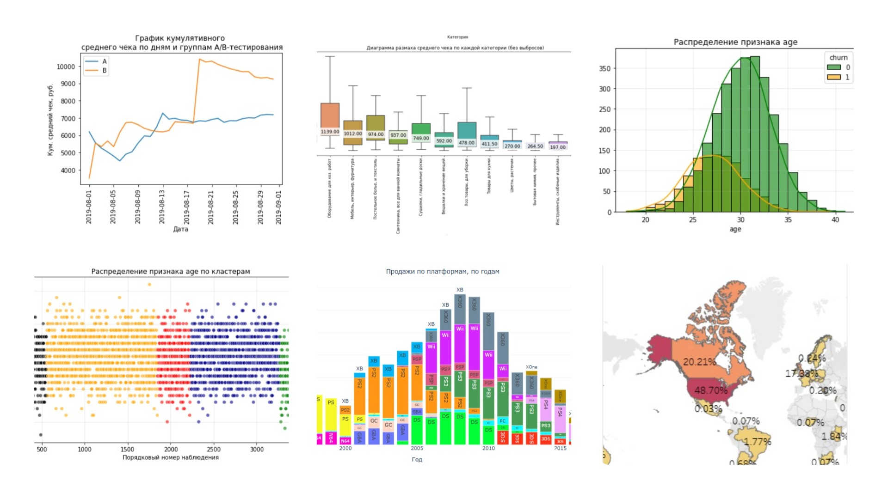

# Лина Гамбург - Портфолио аналитика данных

Данные — это не просто цифры, это истории о поведении пользователей, эффективности бизнеса и скрытых возможностях. В этом репозитории я собираю такие истории.

Здесь представлены проекты, выполненные в рамках расширенной программы по аналитике данных от Яндекс Практикума. Но для меня это было не просто прохождение курса, а полноценная симуляция рабочих задач. Каждый кейс — это история с чёткой бизнес-задачей, гипотезами, глубоким погружением в данные и, что самое важное, — практическими выводами и рекомендациями.

Здесь вы увидите, как я учусь превращать сырые данные в осмысленные истории и обоснованные рекомендации.

# Содержание
| № | Название проекта | Краткое описание проекта | Ключевые результаты |Навыки и инструменты |
| :---- | :--------------------- |:---------------------------| :---------------------------| :---------------------------| 
| 1 |[Профили потребления в E-com](https://github.com/Lina-Hamburg/Portfolio/blob/main/Projects/%D0%9F%D1%80%D0%BE%D1%84%D0%B8%D0%BB%D0%B8%20%D0%BF%D0%BE%D1%82%D1%80%D0%B5%D0%B1%D0%BB%D0%B5%D0%BD%D0%B8%D1%8F%20%D0%B2%20E-com/%D0%9F%D1%80%D0%BE%D1%84%D0%B8%D0%BB%D0%B8%20%D0%BF%D0%BE%D1%82%D1%80%D0%B5%D0%B1%D0%BB%D0%B5%D0%BD%D0%B8%D1%8F%20%D0%B2%20E-com.ipynb)| [Ссылка на презентацию](https://github.com/Lina-Hamburg/Portfolio/blob/main/Projects/%D0%9F%D1%80%D0%BE%D1%84%D0%B8%D0%BB%D0%B8%20%D0%BF%D0%BE%D1%82%D1%80%D0%B5%D0%B1%D0%BB%D0%B5%D0%BD%D0%B8%D1%8F%20%D0%B2%20E-com/%D0%9F%D1%80%D0%B5%D0%B7%D0%B5%D0%BD%D1%82%D0%B0%D1%86%D0%B8%D1%8F_%D0%9F%D1%80%D0%BE%D1%84%D0%B8%D0%BB%D0%B8%20%D0%BF%D0%BE%D1%82%D1%80%D0%B5%D0%B1%D0%BB%D0%B5%D0%BD%D0%B8%D1%8F%20%D0%B2%20E-com.pdf) Сегментация клиентов интернет-магазина товаров для дома на основе анализа транзакций 2019 года. Методом K-Means выявлены профили потребления для перехода от массовых рассылок к персонализированному маркетингу. Цель — повышение лояльности и среднего чека через таргетированные коммуникации.|Выделено 4 сегмента: "Малоактивные" (44%), "Лояльные" (27%), "Премиальные" (5%) и "Оптовые" (4%). Ключевая проблема — зависимость от разовых покупок (63% клиентов). Для каждого сегмента разработаны уникальные маркетинговые стратегии. | Предобработка данных, EDA, кластеризация (K-Means), статистический анализ (метод Манна Уитни), анализ сезонности|
| 2 |[Анализ рынка компьютерных игр](https://github.com/Lina-Hamburg/Portfolio/blob/main/Projects/%D0%90%D0%BD%D0%B0%D0%BB%D0%B8%D0%B7%20%D1%80%D1%8B%D0%BD%D0%BA%D0%B0%20%D0%BA%D0%BE%D0%BC%D0%BF%D1%8C%D1%8E%D1%82%D0%B5%D1%80%D0%BD%D1%8B%D1%85%20%D0%B8%D0%B3%D1%80.ipynb)| Анализ рынка компьютерных игр за 1980-2016 годы для выявления закономерностей успешности. Исследование влияния платформ, жанров, оценок критиков и региональных предпочтений на продажи. Проект позволяет прогнозировать популярные продукты и оптимизировать рекламные кампании на 2017 год.|Выявлены перспективные платформы (PS4, XOne) и жанры (Shooter, Sports) с учетом жизненного цикла платформ. Обнаружены значительные региональные различия и влияние оценок критиков на продажи. Статистически подтверждены различия в пользовательских рейтингах жанров Action и Sports. | Предобработка данных, EDA, корреляционный анализ, проверка гипотез (t-тест, ANOVA), сегментация: региональный анализ, портреты пользователей по платформам и жанрам|
| 3 |[Прогнозирование оттока в фитнес - центре методами Machine learning](https://github.com/Lina-Hamburg/Portfolio/blob/main/Projects/%D0%9F%D1%80%D0%BE%D0%B3%D0%BD%D0%BE%D0%B7%D0%B8%D1%80%D0%BE%D0%B2%D0%B0%D0%BD%D0%B8%D0%B5%20%D0%BE%D1%82%D1%82%D0%BE%D0%BA%D0%B0%20%D0%B2%20%D1%84%D0%B8%D1%82%D0%BD%D0%B5%D1%81%20-%20%D1%86%D0%B5%D0%BD%D1%82%D1%80%D0%B5.ipynb)| Анализ оттока клиентов фитнес-центра для разработки стратегии удержания. Выявление ключевых факторов, влияющих на лояльность клиентов, и сегментация клиентской базы на основе поведения. Цель — снижение оттока через персонализированные подходы к разным группам клиентов.|Выявлены 5 сегментов клиентов с разным уровнем лояльности, где новички с месячными абонементами составляют 99% оттока. Построены модели прогнозирования оттока с accuracy 90% и recall 82%. Разработаны целевые меры удержания для каждой группы, включая программы лояльности и гибкие тарифы. | Предобработка данных, EDA, статистический анализ корреляций признаков с оттоком, ML: логистическая регрессия и случайный лес для прогнозирования оттока, кластеризация K-Means для сегментации клиентов на поведенческие группы.|
| 4 |[Приоретизация гипотез и АВ тест для интернет-магазина](https://github.com/Lina-Hamburg/Portfolio/blob/main/Projects/%D0%9F%D1%80%D0%B8%D0%BE%D1%80%D0%B5%D1%82%D0%B8%D0%B7%D0%B0%D1%86%D0%B8%D1%8F%20%D0%B3%D0%B8%D0%BF%D0%BE%D1%82%D0%B5%D0%B7%20%D0%B8%20%D0%90%D0%92%20%D1%82%D0%B5%D1%81%D1%82.ipynb)| Проект по увеличению выручки интернет-магазина через приоритизацию маркетинговых гипотез и статистический анализ A/B-теста. Были проанализированы гипотезы по фреймворкам ICE/RICE и проведена оценка результатов теста с построением кумулятивных метрик и проверкой статистической значимости. Ключевой задачей было определить эффективность изменений и принять решение о их внедрении.|Методом RICE были выделены три наиболее перспективные идеи. Анализ A/B-теста выявил статистически значимое увеличение конверсии в группе B при отсутствии различий в среднем чеке. На основании результатов тест признан успешным, и рекомендовано внедрение изменений группы B для увеличения выручки. | Приоритизация гипотез (ICE, RICE), предобработка данных, статистический анализ (проверка гипотез, критерий Манна-Уитни), A/B-тестирование|
| 5 |[Анализ сервиса аренды самокатов на основе статистического анализа данных](https://github.com/Lina-Hamburg/Portfolio/blob/main/Projects/%D0%90%D0%BD%D0%B0%D0%BB%D0%B8%D0%B7%20%D1%81%D0%B5%D1%80%D0%B2%D0%B8%D1%81%D0%B0%20%D0%B0%D1%80%D0%B5%D0%BD%D0%B4%D1%8B%20%D1%81%D0%B0%D0%BC%D0%BE%D0%BA%D0%B0%D1%82%D0%BE%D0%B2.ipynb)| Анализ данных сервиса аренды самокатов для проверки гипотез о финансовой выгодности пользователей с подпиской. Необходимо было проанализировать поведенческие паттерны клиентов и сравнить ключевые метрики между группами с подпиской и без подписки. Основная задача - определить, действительно ли пользователи с платной подпиской приносят больше выручки и являются более перспективными для бизнеса.|Подтверждено, что пользователи с подпиской тратят на 6% больше времени на поездки и приносят значительно более высокую помесячную выручку. При этом среднее расстояние их поездок не превышает критическую точку износа самокатов. | Предобработка данных, EDA , статистический анализ (t-тест), вероятностное моделирование (биномиальное распределение, нормальная аппроксимация), визуализация данных (кумулятивные распределения)|
| 6 |[Анализ маркетинговых вложений на продвижение развлекательного приложения](https://github.com/Lina-Hamburg/Portfolio/blob/main/Projects/%D0%90%D0%BD%D0%B0%D0%BB%D0%B8%D0%B7%20%D0%BC%D0%B0%D1%80%D0%BA%D0%B5%D1%82%D0%B8%D0%BD%D0%B3%D0%BE%D0%B2%D1%8B%D1%85%20%D0%B2%D0%BB%D0%BE%D0%B6%D0%B5%D0%BD%D0%B8%D0%B9%20%D0%BD%D0%B0%20%D0%BF%D1%80%D0%BE%D0%B4%D0%B2%D0%B8%D0%B6%D0%B5%D0%BD%D0%B8%D0%B5%20%D1%80%D0%B0%D0%B7%D0%B2%D0%BB%D0%B5%D0%BA%D0%B0%D1%82%D0%B5%D0%BB%D1%8C%D0%BD%D0%BE%D0%B3%D0%BE%20%D0%BF%D1%80%D0%B8%D0%BB%D0%BE%D0%B6%D0%B5%D0%BD%D0%B8%D1%8F.ipynb)| Задачей был комплексный анализ эффективности маркетинговых кампаний: оценка окупаемости рекламы (LTV, ROI, CAC), изучение поведения пользователей из разных источников, стран и с разных устройств. Ключевой целью было определить, какие каналы привлечения и сегменты аудитории являются убыточными, и сформулировать рекомендации по оптимизации бюджета.|Установлено, что реклама не окупается из-за высоких и растущих затрат на привлечение пользователей из США через некоторые каналы, при том что удержание этой аудитории низкое. Выявлены перспективные каналы и аудитория с положительной окупаемостью. Подготовлены рекомендации по перераспределению маркетингового бюджета и мерам для повышения удержания ключевых сегментов. | Предобработка данных, когортный анализ (Retention Rate, LTV, ROI), юнит-экономика (CAC, LTV, ROI), сегментация по рекламным каналам, странам, устройствам.|
